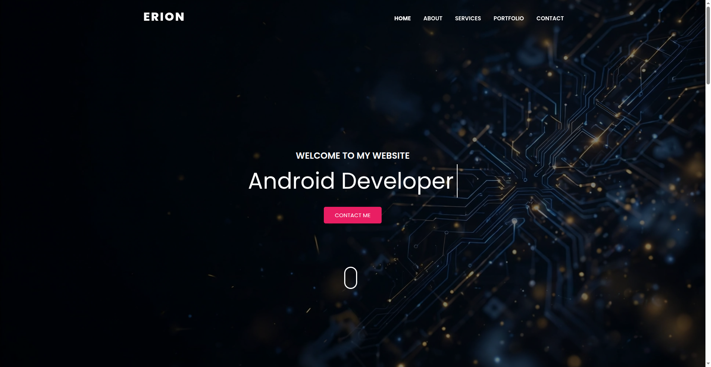

# Erion Nezha — Portofoli Personal 🇦🇱

Portofoli personal i **Erion Nezhës**, Software Developer (Junior Web Developer) me bazë në Tiranë, Shqipëri.

## Demo live

https://erionnezha.github.io/Portfolio/

Janë përfshirë dy variante të faqes kryesore:

- `index.html` — faqja kryesore
- `index-particles.html` — faqe alternative me sfond të animuar grimcash

## Përmbajtja

- **Rreth meje** — biografia, vendndodhja (Tiranë, Shqipëri), detajet e kontaktit, aftësitë
- **Shërbimet** — zhvillim web, dizajn responsive, implementim UI, JavaScript, bazat e Android, optimizim
- **Portofoli** — gjashtë projekte reale me përshkrime dhe linke GitHub:
  - Dertli Bot — chatbot AI në shqip
  - Python Mini Projects — 24 projekte me turtle graphics
  - Internet Service Provider — sistem menaxhimi Java Swing + MySQL
  - Simple Food Ordering — aplikacion console në C++
  - Memory Card Game — HTML/CSS/JS
  - ERION IPTV — aplikacion TV (në progres)
- **Kontakti** — formulari hap klientin e email-it të vizitorit përmes `mailto:` me subjekt dhe mesazh të plotësuar paraprakisht (nuk kërkon backend, funksionon në GitHub Pages)

## Shënime

Ndërtuar mbi shabllonin HTML të portofolit "Mason". Vetëm tekstet, linket, aftësitë dhe logjika e formularit të kontaktit u personalizuan për Erion Nezhën; dizajni, struktura dhe CSS e shabllonit u lanë të paprekura. Seksioni i dëshmive të shabllonit u hoq (pa komente të fabrikuara).

© 2026 Erion Nezha. Të gjitha të drejtat e rezervuara.

---

# Erion Nezha — Personal Portfolio 🇬🇧

Personal portfolio website of **Erion Nezha**, Software Developer (Junior Web Developer) based in Tirana, Albania.

## Live demo

https://erionnezha.github.io/Portfolio/

Two homepage variants are included:

- `index.html` — main homepage
- `index-particles.html` — alternate homepage with an animated particles background

## Contents

- **About** — bio, location (Tirana, Albania), contact details, skills
- **Services** — web development, responsive design, UI implementation, JavaScript, Android basics, optimization
- **Portfolio** — six real projects with descriptions and GitHub links:
  - Dertli Bot — Albanian AI chatbot
  - Python Mini Projects — 24 turtle graphics projects
  - Internet Service Provider — Java Swing + MySQL management system
  - Simple Food Ordering — C++ console app
  - Memory Card Game — HTML/CSS/JS
  - ERION IPTV — TV app (in progress)
- **Contact** — the form opens the visitor's email client via `mailto:` with a pre-filled subject and message (no backend required, works on GitHub Pages)

## Notes

Personal portfolio created by **Erion Nezha** — bio, skills, projects and contact section, with a working contact form (opens the visitor's email client via `mailto:`, no backend required).

© 2026 Erion Nezha. All rights reserved.
